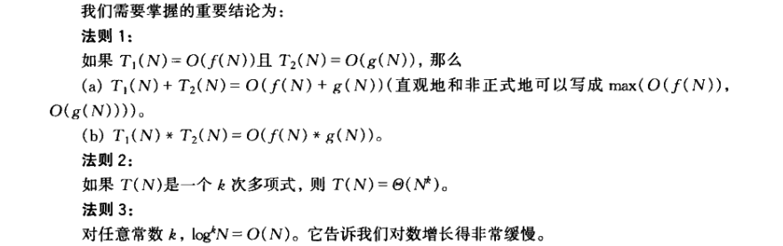
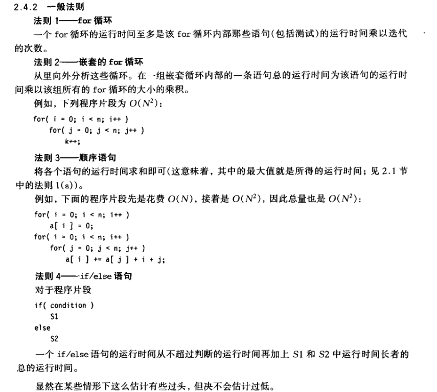

# DataStructuresAndAlgorithmAnalysisInJava2th_Book
《数据结构与算法分析：Java语言描述（第2版）》 ，阅读与实践！ 2017.07.25
###
[目录](catalog.md)
##
第1章 引论
####
递归的四条基本法则
1. 基准情况。必须总要有某些基准情况，它无需递归就能解出。
2. 不断推进。对于那些需要递归求解的情况，每一次递归调用都必需要使状况朝向一种基准情况推进。
3. 设计法则。假设所有的递归调用都能运行。
4. 合成效益法则。在求解一个问题的同一实例时，切勿在不同的递归调用中做重复性的工作。

**课后例题答案：**
 ``` 
 1.5 public static int calc(int n){
        if(n<2)
            return n;
        return n%2+calc(n/2);
    }
```
##
第2章 算法分析


**课后例题答案：**
```
1.6
//第一步，求所有可能出现在第一个位置的字符，即把第一个字符和后面所有的字符交换。第二步，固定第一个字符，求后面所有字符的全排列。
// 这个时候仍然把后面所有字符分为两部分：第一个字符以及其后所有字符。这是一个典型的递归问题。
public class C0106 {

   static List<String> list=new ArrayList<>() ;

    public static List<String> perm(char[] buf, int start, int end){

        if(start == end){
            String result = "";
            for(int i=0 ; i<end ; i++){
                result += buf[i];
            }
            System.out.println("-->>"+result.toString());
            list.add(result);
            result = "";
        }else{
            for(int i=start ; i<buf.length ; i++){
                char temp = buf[i];
                buf[i] = buf[start];
                buf[start] = temp;
                System.out.println("-1start->>"+start+"  i="+i);
                perm(buf, start+1, end);

                temp = buf[i];
                buf[i] = buf[start];
                buf[start] = temp;
                System.out.println("-2start->>"+start+"  i="+i);
            }
        }
        return list;
    }

    public static void main(String [] aa){
       String aa1= C0106.perm(new char[]{'a','b','c'},0,3).toString();
        System.out.printf(aa1);
    }

}

```
##
第3章 表、栈和队列
```
```
##
第4章 树
```
```
##
第5章 散列
```
```
##
第6章 优先队列（堆）
```
```
##
第7章 排序
```
```
##
第8章 不相交集类
```
```
##
第9章 图论算法
```
```
##
第10章 算法设计技巧
```
```
##
第11章 摊还分析
```
```
##
第12章 高级数据结构及其实现
>ss
###
[课后答案](数据结构与算法分析_java语言描述_Mark_Allen_Weiss著_课后习题答案.pdf)
#
>Over 